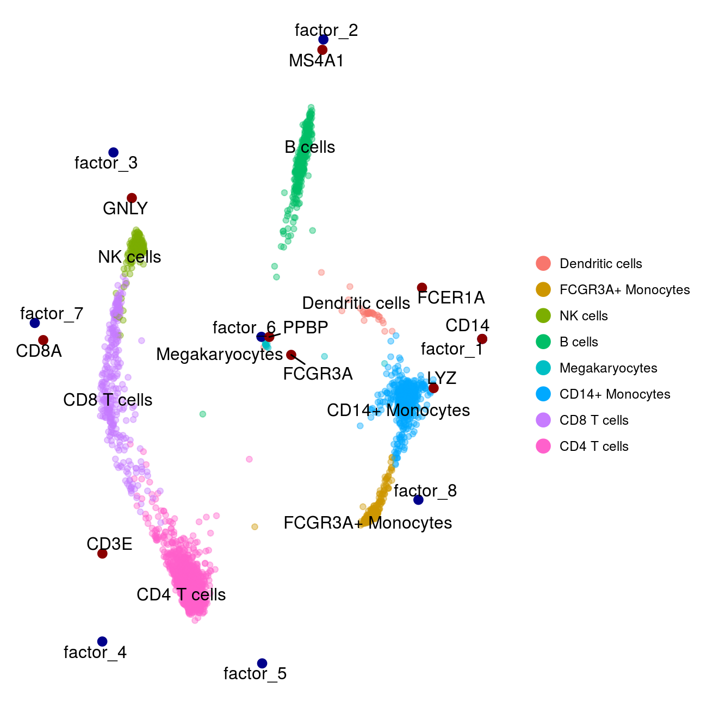

# swne
Similarity Weighted Nonnegative Embedding (SWNE), a method for visualizing high dimensional datasets

## Manuscripts
You can find our bioRxiv preprint here: https://www.biorxiv.org/content/early/2018/03/05/276261

## Installation instructions

1. Install devtools with `install.packages("devtools")` if not already installed
2. Install liger with `devtools::install_github("JEFworks/liger")`
3. Install swne with `devtools::install_github("yanwu2014/swne")`

## Usage
We highly recommend using SWNE with either Seurat (http://satijalab.org/seurat/) or Pagoda2 (https://github.com/hms-dbmi/pagoda2), two general single cell RNA-seq analysis pipelines. 

For a quick example using the pbmc dataset from 10x genomics, see pbmc3k_swne.R and the pre-computed
Seurat object under the Examples directory.

## Scripts
To recreate the figures from our preprint, see the Scripts/ directory. The raw data is listed in the preprint.
